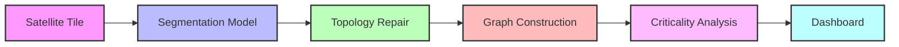

# NERVA: Network Resilience & Vulnerability Analyzer

> **Occlusion-Robust Road Extraction & Graph-Theoretic Criticality Analysis for Urban Mobility**

[](#)
[](https://opensource.org/licenses/MIT)
[](#)

## Problem Statement

Satellite-based road extraction in dense urban areas suffers from "spectral blindness," where tree canopies, building shadows, and cloud cover fragment detected road masks. This occlusion destroys the topological connectivity required for real-world applications, rendering standard extraction unusable for critical tasks like disaster response and traffic simulation. 

## Our Approach

NERVA addresses this through a robust two-stage pipeline that bridges the gap between raw, occluded satellite imagery and an interactive, queryable city resilience graph.



### Stage 1: Occlusion-Robust Extraction
We fine-tune a pretrained SegFormer-B2 model on the DeepGlobe Roads dataset, applying it to Sentinel-2 and ISRO Bhuvan satellite imagery of Bengaluru. Our approach augments the standard segmentation loss with a topology-aware connectivity constraint. The model is penalized for breaking road continuity under occlusion, optimizing for topological correctness rather than just pixel-level accuracy.

### Stage 2: Topological Repair & Graph Intelligence
The raw output mask is skeletonized, and remaining discontinuities are bridged via shortest-path stitching. The result is converted into a weighted NetworkX graph, where intersections represent nodes and road segments act as weighted edges. We execute advanced criticality analysis on this graph, including betweenness centrality (load evaluation), articulation/bridge point detection (single points of failure), and interactive edge-removal simulation to quantify the impact of losing any given road.

## Key Features

- **Occlusion-Robust Segmentation:** Topology-aware loss mitigates fragmentation caused by canopies and shadows.
- **Automated Topology Repair:** Algorithmic shortest-path stitching to bridge remaining gaps in road networks.
- **Graph-Theoretic Intelligence:** Identifies critical infrastructure vulnerabilities (bridges, bottlenecks, single points of failure).
- **Interactive Resilience Dashboard:** Visualize load dynamics and simulate targeted edge-removals (e.g., road closures) in real-time.
- **End-to-End Pipeline:** Goes beyond standard segmentation to deliver a fully queryable, mathematically rigorous routing graph.

## Tech Stack

| Category | Technologies |
| :--- | :--- |
| **AI / ML** | PyTorch, HuggingFace Transformers (SegFormer-B2), GUDHI (Topological Data Analysis) |
| **Graph Engine** | NetworkX, Python |
| **Backend** | FastAPI |
| **Frontend** | React, Leaflet / deck.gl |
| **Data Sources** | Sentinel-2, ISRO Bhuvan, DeepGlobe Roads |

## Project Status

**🚧 Active Development**

NERVA is currently in active development for the ISRO Hackathon (Problem 4). The architecture has been finalized, and we are systematically executing against our roadmap:

- **Phase 1: Data & Computer Vision Model:** (In Progress) Dataset curation and SegFormer-B2 fine-tuning with topology-aware loss.
- **Phase 2: Graph Engine:** (Planned) Skeletonization, topology repair, and integration of NetworkX criticality analysis.
- **Phase 3: Dashboard Integration:** (Planned) Hooking the FastAPI backend to the React/deck.gl frontend for interactive visualization.

## Team: Tessellate

- **[Your Name]** — Systems Architect & Graph Intelligence
  - *Focus:* Graph construction, criticality analysis, backend architecture, frontend dashboard.
  - [](#) [](#)
- **[Friend's Name]** — Computer Vision Engineer
  - *Focus:* Segmentation model fine-tuning, topology-aware loss implementation.
  - [](#) [](#)

## How to Run

> **Note:** These are placeholder instructions. Detailed setup commands will be provided once the initial codebase is pushed.

```bash
# TODO: Clone the repository
# git clone https://github.com/your-username/nerva.git
# cd nerva

# TODO: Set up the Python virtual environment and install backend dependencies
# python -m venv venv
# source venv/bin/activate
# pip install -r requirements.txt

# TODO: Download model weights and place them in the appropriate directory
# mkdir weights && cd weights && wget <model-url>

# TODO: Install frontend dependencies
# cd frontend
# npm install

# TODO: Run the FastAPI backend and React frontend development servers
# (Detailed commands coming soon)
```

## License

This project is licensed under the MIT License - see the [LICENSE](LICENSE) file for details.
